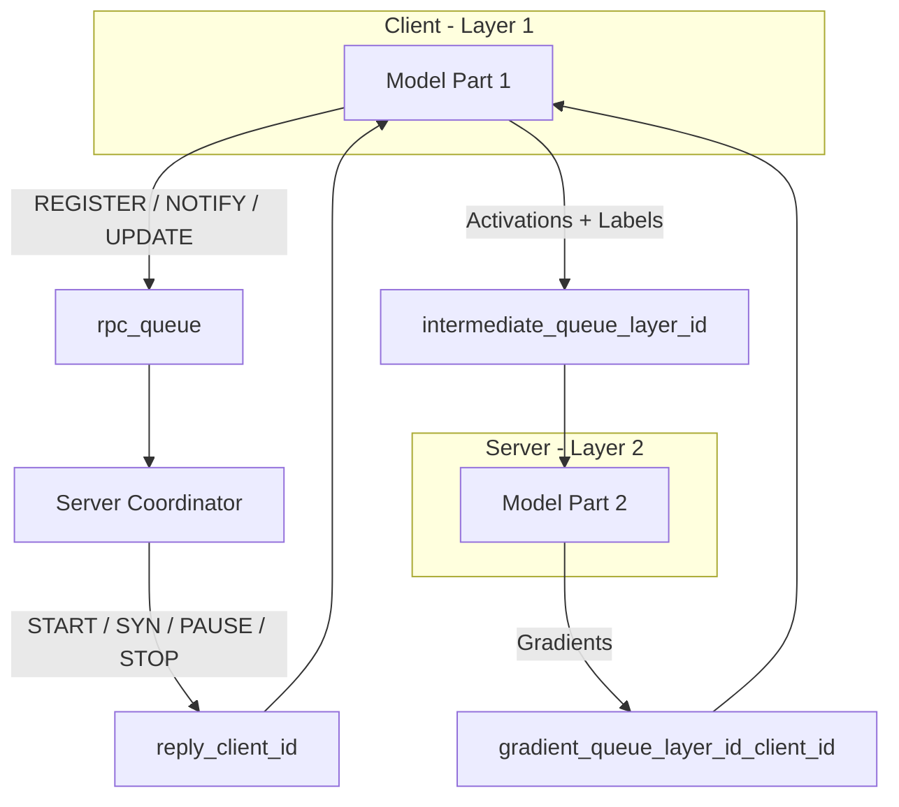

# Phân tích Hệ thống Hàng đợi (RabbitMQ) và Định dạng Bản tin trong SplitFedLLM

Tài liệu này phân tích chi tiết tất cả các hàng đợi (queues) được sử dụng trong hệ thống, các loại bản tin trao đổi giữa Server và Clients, kèm theo cấu trúc mẫu bản tin (dưới dạng JSON/Python Dictionary) và giải thích cụ thể từng trường dữ liệu.

Các bản tin trong mã nguồn được tuần tự hóa (serialized) bằng thư viện `pickle` của Python để hỗ trợ gửi các đối tượng phức tạp như PyTorch State Dict và Numpy Array qua giao thức AMQP của RabbitMQ.

---

## 1. Bản đồ hệ thống hàng đợi (RabbitMQ Queues)

Hệ thống sử dụng **4 nhóm hàng đợi** chính để phối hợp giữa Server và nhiều Clients chạy song song:



| Tên Hàng đợi | Chiều truyền dữ liệu | Phương thức phân phối | Mục đích |
| :--- | :---: | :---: | :--- |
| **`rpc_queue`** | Client $\to$ Server | Shared (Nhiều gửi, 1 nhận) | Gửi các bản tin điều khiển từ Client tới Server (Đăng ký, cập nhật tham số, thông báo hoàn thành). |
| **`reply_{client_id}`** | Server $\to$ Client | Private (1 gửi, 1 nhận) | Gửi lệnh điều hành từ Server đến từng Client cụ thể (Bắt đầu, đồng bộ hóa, tạm dừng, dừng hẳn). |
| **`intermediate_queue_{layer_id}`** | Layer 1 Client $\to$ Layer 2 Server/Client | Shared (Forward) | Gửi dữ liệu kích hoạt trung gian (intermediate activations) và nhãn để chạy pha Forward tiếp theo. |
| **`gradient_queue_{layer_id}_{client_id}`** | Layer 2 Server/Client $\to$ Layer 1 Client | Private (Backward) | Gửi dữ liệu gradient ngược từ lớp trên về lớp dưới cho Client cụ thể tiến hành Backpropagation. |

---

## 2. Chi tiết các loại bản tin và cấu trúc mẫu

### 2.1. Bản tin trên hàng đợi điều phối chính (`rpc_queue` và `reply_{client_id}`)

#### A. Bản tin `REGISTER` (Client $\to$ Server)
* **Thời điểm gửi:** Khi Client khởi động, gửi bản tin này lên `rpc_queue` để đăng ký sự hiện diện với Server.
* **Cấu trúc mẫu:**
```json
{
  "action": "REGISTER",
  "client_id": "c1a93bd8-c2a4-4f0e-b7d8-cf7e48b8b7a6",
  "layer_id": 1,
  "message": "Client c1a93bd8 registered successfully"
}
```
* **Giải thích các trường:**
  - `action`: Hành động đăng ký thiết bị (`REGISTER`).
  - `client_id`: ID duy nhất của Client (dạng UUID chuỗi).
  - `layer_id`: Vị trí lớp của Client (`1` cho phần đầu/biên, `2` cho phần sau/trung tâm).

---

#### B. Bản tin `START` (Server $\to$ Client)
* **Thời điểm gửi:** Khi Server nhận đủ số lượng kết nối đăng ký từ Clients, Server sẽ phân tách mô hình và gửi trọng số khởi tạo cùng cấu hình qua `reply_{client_id}`.
* **Cấu trúc mẫu:**
```json
{
  "action": "START",
  "message": "Server accept the connection!",
  "model_name": "BERT",
  "cut_layers": 4,
  "total_block": 12,
  "fine_tune_config": {
    "client": true,
    "server": false,
    "LoRA": {
      "r": 8,
      "alpha": 16
    }
  },
  "bottleneck_config": {
    "enable": true,
    "bottleneck_dim": 128
  },
  "parameters": {
    "embeddings.word_embeddings.weight": [/* Tensor weights data ... */],
    "layers.0.attention.self.query.weight": [/* Tensor weights data ... */]
  },
  "bottleneck": {
    "encoder.0.weight": [/* Tensor weights data ... */],
    "encoder.3.weight": [/* Tensor weights data ... */]
  }
}
```
* **Giải thích các trường:**
  - `model_name`: Tên mô hình huấn luyện (`BERT` hoặc `GPT2`).
  - `cut_layers`: Điểm cắt mô hình (số lượng block phân bổ cho Client).
  - `total_block`: Tổng số block transformer của mô hình gốc (thường là 12).
  - `fine_tune_config`: Cấu hình PEFT LoRA cho Client và Server.
  - `bottleneck_config`: Cài đặt nén giảm băng thông truyền tải.
  - `parameters`: Trọng số phân mảnh của mô hình tương ứng với `layer_id` của Client (dạng PyTorch state_dict).
  - `bottleneck`: Trọng số của khối Bottleneck Encoder (ở Layer 1) hoặc Decoder (ở Layer 2).

---

#### C. Bản tin `SYN` (Server $\to$ Client)
* **Thời điểm gửi:** Gửi ngay sau bản tin `START` khoảng 5 giây. Nó đồng bộ hóa các siêu tham số huấn luyện của lượt đó và kích hoạt vòng huấn luyện tại chỗ ở Client.
* **Cấu trúc mẫu:**
```json
{
  "action": "SYN",
  "label_counts": [[100, 100, 100, 100], [100, 100, 100, 100]],
  "control_count": 1,
  "batch_size": 8,
  "lr": 0.00001,
  "weight_decay": 0.01,
  "stt": 0,
  "message": "Synchronize client devices"
}
```
* **Giải thích các trường:**
  - `label_counts`: Mảng phân bổ số lượng mẫu huấn luyện theo từng nhãn cho từng Client (giúp thiết lập phân phối dữ liệu Non-IID hoặc IID).
  - `control_count`: Số bước huấn luyện cục bộ tối đa trước khi đồng bộ.
  - `stt`: Số thứ tự định danh phân phối dữ liệu của Client này trong lượt FL.
  - `batch_size`, `lr`, `weight_decay`: Siêu tham số tối ưu hóa cục bộ.

---

#### D. Bản tin `NOTIFY` (Client $\to$ Server)
* **Thời điểm gửi:** Gửi từ Client lên `rpc_queue` khi Client hoàn thành việc duyệt hết tập dữ liệu huấn luyện cục bộ (kết thúc Epoch).
* **Cấu trúc mẫu:**
```json
{
  "action": "NOTIFY",
  "client_id": "c1a93bd8-c2a4-4f0e-b7d8-cf7e48b8b7a6",
  "layer_id": 1,
  "message": "Client c1a93bd8 finished training"
}
```

---

#### E. Bản tin `PAUSE` (Server $\to$ Client)
* **Thời điểm gửi:** Khi Server thu đủ thông báo `NOTIFY` của tất cả các Client, Server sẽ gửi lệnh `PAUSE` qua `reply_{client_id}` yêu cầu Client dừng huấn luyện và đóng gói tham số gửi về.
* **Cấu trúc mẫu:**
```json
{
  "action": "PAUSE",
  "message": "Pause training and please send your parameters",
  "parameters": null
}
```

---

#### F. Bản tin `UPDATE` (Client $\to$ Server)
* **Thời điểm gửi:** Gửi từ Client phản hồi lại lệnh `PAUSE`, chứa trọng số mô hình đã được huấn luyện cục bộ để Server chạy giải thuật FedAvg.
* **Cấu trúc mẫu:**
```json
{
  "action": "UPDATE",
  "client_id": "c1a93bd8-c2a4-4f0e-b7d8-cf7e48b8b7a6",
  "layer_id": 1,
  "result": true,
  "size": 3146433,
  "message": "Sent parameters to Server",
  "parameters": {
    "embeddings.word_embeddings.weight": [/* Updated Tensor weights data ... */],
    "layers.0.attention.self.query.weight": [/* Updated Tensor weights data ... */]
  }
}
```
* **Giải thích các trường:**
  - `result`: Trạng thái huấn luyện có thành công hay không (Boolean).
  - `size`: Kích thước bytes của gói tin truyền thông điệp giúp tính toán tài nguyên mạng.
  - `parameters`: Trọng số mô hình cục bộ của Client sau huấn luyện (chỉ chứa các tham số được cập nhật, ví dụ LoRA weights).

---

#### G. Bản tin `STOP` (Server $\to$ Client)
* **Thời điểm gửi:** Khi hết số vòng huấn luyện toàn cục (`global-round`) hoặc mô hình hội tụ/đạt điều kiện dừng, Server gửi lệnh giải tán hệ thống.
* **Cấu trúc mẫu:**
```json
{
  "action": "STOP",
  "message": "Stop training!"
}
```

---

### 2.2. Bản tin trung gian trong quá trình lan truyền (Forward / Backward)

Các bản tin này được truyền liên tục theo từng **Mini-batch** trong quá trình huấn luyện:

#### H. Bản tin Forward (`intermediate_queue_{layer_id}`)
* **Thời điểm gửi:** Layer 1 chạy Forward xong batch dữ liệu, đóng gói kích hoạt trung gian truyền lên Layer 2 (Server/Client kế tiếp).
* **Cấu trúc mẫu:**
```json
{
  "data_id": "9b1deb4d-3b7d-4bad-9bdd-2b0d7b3dcb6d",
  "data": [/* Numpy Array float32 shape [B, T, Dim] */],
  "label": [/* Tensor int64 shape [B] hoặc [B, T] */],
  "attention_mask": [/* Tensor int64 shape [B, T] - Chỉ có ở GPT-2 */],
  "trace": ["c1a93bd8-c2a4-4f0e-b7d8-cf7e48b8b7a6"]
}
```
* **Giải thích các trường:**
  - `data_id`: Khóa UUID ngẫu nhiên để đánh dấu batch dữ liệu này, dùng để khớp gradient phản hồi ở chiều backward.
  - `data`: Kích hoạt trung gian (intermediate activations). Nếu bật bottleneck, chiều `Dim` sẽ được nén (ví dụ từ 768 xuống 128).
  - `label`: Nhãn giám sát đi kèm để tính hàm Loss ở Layer 2.
  - `attention_mask` (chỉ dành cho GPT-2): Mặt nạ chú ý tương ứng của batch đầu vào.
  - `trace`: Danh sách chứa chuỗi các client_id mà batch dữ liệu này đã đi qua để định tuyến gradient chiều ngược lại.

---

#### I. Bản tin Backward (`gradient_queue_{layer_id - 1}_{client_id}`)
* **Thời điểm gửi:** Layer 2 nhận activations $\to$ tính Loss $\to$ Backward đến đầu Layer 2 thu được gradient $\to$ Đóng gói gửi trả về Layer 1 cho Client cụ thể để chạy tiếp backward cục bộ.
* **Cấu trúc mẫu:**
```json
{
  "data_id": "9b1deb4d-3b7d-4bad-9bdd-2b0d7b3dcb6d",
  "data": [/* Numpy Array float32 shape [B, T, Dim] */],
  "trace": []
}
```
* **Giải thích các trường:**
  - `data_id`: Khớp đúng ID của batch đã forward để Client lấy đúng dữ liệu lưu trữ tạm thời (`data_store`) chạy tiếp chu trình lan truyền ngược.
  - `data`: Ma trận gradient của kích hoạt trung gian có cùng kích thước với tensor kích hoạt ở chiều forward.
  - `trace`: Lịch sử vết định tuyến còn lại sau khi pop đi client hiện tại (dùng để chuyển tiếp nếu Split Learning có nhiều hơn 2 tầng).
